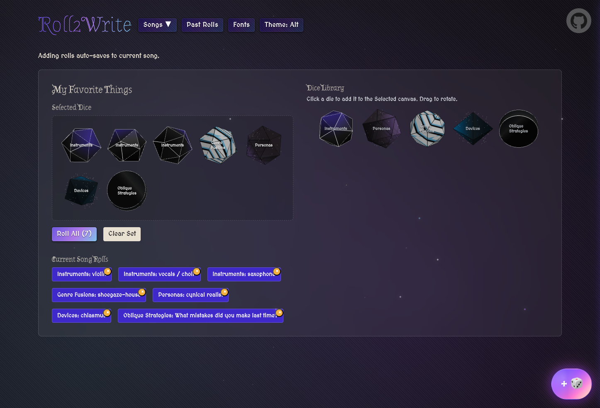

# [Roll2Write](roll2write.chas.ms)

A songwriting game created in a few days for A.G. Cook's [School of Song](https://schoolofsong.org/) course.

Aesthetic inspired by [A.G.](https://www.instagram.com/newalias/?hl=en) and [Old School Runescape](https://play.runescape.com/oldschool)

Create custom dice to inspire your own songwriting process [just like A. G. does](#ag-cooks-lyric-oracle)!




### A.G. Cook's Lyric Oracle


### About

This project is configured with:

- Vite
- Typescript
- React
- SCSS Modules (migrated from PandaCSS)
- [Typesafe SCSS Module classname lookups](https://dev.to/activeguild/type-safe-development-with-vite-x-react-x-css-modules-x-typescript-1ebc)
- [Stylelint](https://stylelint.io/)
- HMR via [SWC](https://swc.rs/)
- [ESLint rules and formatting](./eslint.config.ts)
- [VSCode settings](./.vscode/settings.json)
- and [Copilot Instructions](./.github/copilot-instructions.md)
- Playwright, [Playwright MCP](https://github.com/microsoft/playwright-mcp), and the [Playwright MCP Chrome Extension](https://github.com/microsoft/playwright-mcp/blob/main/extension/README.md) - to enable Copilot to interact with and debug the frontend via the browser and development server

### Getting Started

```bash
npm install
npm run dev
```

##### Linting

```bash
npm run lint
```

or to run autofix (this will happen automatically on save but sometimes it's still useful):

```bash
npm run lintfix
```

##### Types

```bash
npm run typecheck
```

or to run a continuous typecheck in an open shell:

```bash
npm run typewatch
```
